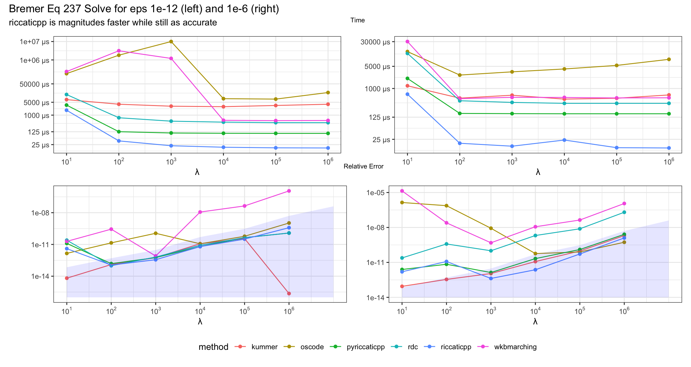

# riccati

A package implementing the adaptive Riccati defect correction (ARDC) method

[](https://doi.org/10.21105/joss.05430)
[](https://riccati.readthedocs.io/en/latest/?badge=latest)
[](https://codecov.io/gh/fruzsinaagocs/riccati)

## About

This package is a C++ port of the [riccati](https://github.com/fruzsinaagocs/riccati) python package.

`riccati` is a `C++` package for solving ODEs of the form

$$ u''(t) + 2\gamma(t)u'(t) + \omega^2(t)u(t) = 0,$$

on some solution interval $t \in [t_0, t_1]$, and with initial conditions $u(t_0) = u_0$, $u'(t_0) = u'_0$.

`riccati` uses the adaptive Riccati defect correction method -- it switches
between using nonoscillatory (spectral Chebyshev) and a specialised oscillatory
solver (Riccati defect correction) to propagate the numerical solution based on
its behaviour. For more details on the algorithm, please see [Attribution](https://github.com/stevebronder/riccaticpp/blob/master/README.md#Attribution).

## Benchmarks

Benchmarks are available in `python/benchmarks` and can be run with

```bash
cmake -S . -B "build" -DCMAKE_BUILD_TYPE=RELEASE  -DRICCATI_BUILD_TESTING=ON
cd build/python/benchmark
make -j4 figgen
```

Below is a graph camparing several methods over Bremer's phase function method on Eq. (237) in Bremer 2018. The omega and gamma functions are given by the following.

$$
\begin{align}
\omega(x) &= \lambda \sqrt{1 - x^2 \cos(3x)} \\
\gamma(x) &= 0
\end{align}
$$



The blue area in the graph of errors is the best possible lower bound for error calculated by Bremer. 
Because the results of each algorithm are compared relative to Bremer's values, the algorithms may report 
smaller values than the actual possible error, but should be considered bounded by the blue area.

## Documentation

Read the documentation at [the docs site](https://stevebronder.com/riccaticpp/).

## Attribution

If you find this code useful in your research, please cite
[Agocs & Barnett (2022)](https://arxiv.org/abs/2212.06924). Its BibTeX entry is

    @ARTICLE{ardc,
           author = {{Agocs}, Fruzsina J. and {Barnett}, Alex H.},
            title = "{An adaptive spectral method for oscillatory second-order
            linear ODEs with frequency-independent cost}",
          journal = {arXiv e-prints},
         keywords = {Mathematics - Numerical Analysis},
             year = 2022,
            month = dec,
              eid = {arXiv:2212.06924},
            pages = {arXiv:2212.06924},
              doi = {10.48550/arXiv.2212.06924},
    archivePrefix = {arXiv},
           eprint = {2212.06924},
     primaryClass = {math.NA},
           adsurl = {https://ui.adsabs.harvard.edu/abs/2022arXiv221206924A},
          adsnote = {Provided by the SAO/NASA Astrophysics Data System}
    }

## License

Copyright 2024 The Simons Foundation, Inc.

**riccati** is free software available under the BSD 3.0, for
details see the [LICENSE](https://github.com/fruzsinaagocs/riccati/blob/master/LICENSE).

## Building Tests

From the top level directory you can build and call the tests with the following.

```bash
# DEBUG build types enable 0g, ggdb3, and pretty printing helper functions in utils
cmake -S . -B "build" -DCMAKE_BUILD_TYPE=RELEASE  -DRICCATI_BUILD_TESTING=ON -DRICCATI_BUILD_BENCHMARKS=ON -DRICCATI_BUILD_PYTHON=ON
cd build/tests
make -j4 riccati_test && ctest
```

## Example

As an example we will solve Bremer's Eq. 237 where the omega and gamma functions are given by the following.

$$
l = 10
\omega(x) = l \sqrt{1 - x^2 \cos(3x)}
\gamma(x) = 0
$$

In the code we use the `riccati::vectorize` function to convert the scalar functions to vector functions. 
We then use the `riccati::make_solver` function to create the solver object. 
Finally we use the `riccati::evolve` function to solve the ODE.

```cpp


```

## Including

`riccaticpp` is a header only library and so any project can include it just by copy/pasting in the include folder. For cmake based projects

```cmake
include(FetchContent)

FetchContent_Declare(
  riccaticpp
  https://github.com/SteveBronder/riccaticpp
  main # Use a specific version or commit
)
FetchContent_MakeAvailable(riccaticpp)

# For your target
target_link_libraries(target_name riccati)
```

See the example [here]()